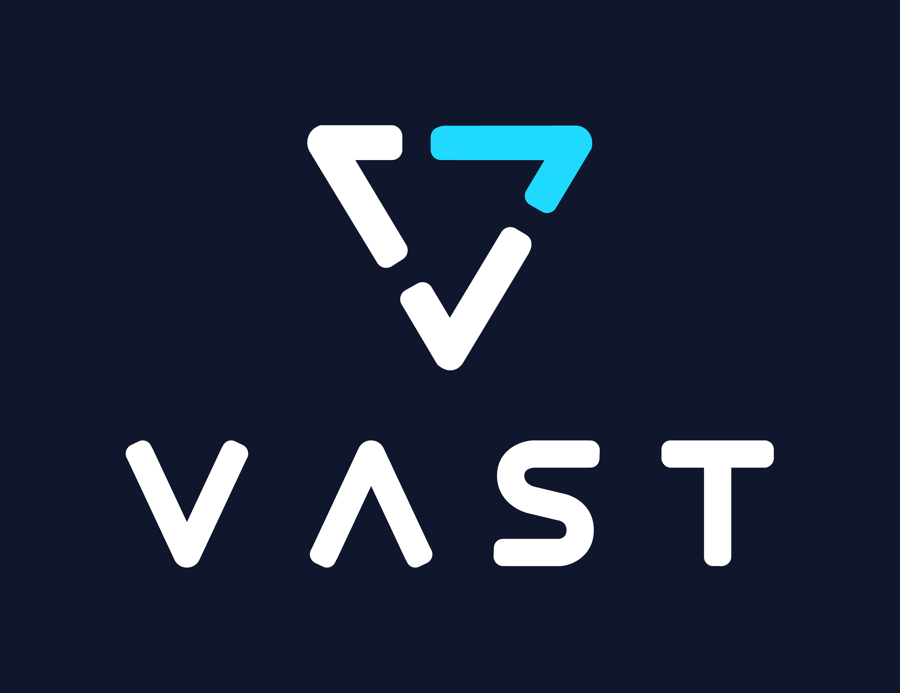

<p align="center">
  
</p>

---

# VUA

VUA is a system for storing and retrieving key-value caches of deep learning models, utilizing a directory structure derived from token values.

## Developer Quick Start

1. **Understanding VUA**

   VUA splits tokens into groups defined by a fixed split factor (see `VUAConfig.split_factor`). Tokens are converted to directory names where cache data is stored. The `put()` method splits key-value caches and stores fragmented tensor data into these directories, while `get_closest()` fetches the closest matching cache fragment based on supplied token prefixes.

2. **Exploring the Codebase**

   - **`src/vua/core.py`**: Contains the primary VUA implementation with `put()` and `get_closest()`, plus token-to-path conversion logic.
   - **`src/vua/serdes.py`**: Provides tensor serialization/deserialization functions (`tensor_to_bytes` and `bytes_to_tensor`) for efficiently handling PyTorch tensors. Compatible to safetensors.
   - **`tests/test_vua.py`**: Offers tests to validate token processing, cache storage and retrieval, and tensor serialization.

3. **Running the Tests**

   Run the tests by executing:
   ```bash
   uv run python -m unittest discover -s tests
   ```
4. **Using VUA in Your Project**

   - Create a VUA instance by providing a configuration (e.g. `VUAConfig`) and a directory path for cache storage.
   - Utilize `put()` to store computed key-value caches and `get_closest()` to retrieve cached data based on token queries.
   - **Batched Operations:** VUA supports batched put and get operations. If you provide a 2D tensor of tokens to `put()`, it processes each sequence in parallel. Similarly, calling `get_closest()` with a list of token tensors returns a list of corresponding `ClosestKV` results.

   **Example:**

   ```python
   import os
   import torch
   from vua.core import VUA, VUAConfig

   # Set up cache storage directory
   cache_dir = "./vua_cache"
   os.makedirs(cache_dir, exist_ok=True)

   # Create a VUA instance
   vua = VUA(VUAConfig, cache_dir)

   # Generate sample tokens ensuring the length is divisible by split_factor
   tokens = torch.randint(0, 0xFFFF, (1, 512), dtype=torch.uint16)
   trimmed_tokens = VUAConfig.trim_to_split_factor(tokens)

   # Create a sample key-value cache (for demonstration purposes)
   # This is a list with one layer and two tensor pairs (keys and values)
   kvcache = [[torch.randn(1, 2, trimmed_tokens.size(1), 64), torch.randn(1, 2, trimmed_tokens.size(1), 64)]]

   # Store the cache using put()
   vua.put(trimmed_tokens, kvcache)

   # Retrieve the cache using get_closest()
   result = vua.get_closest(trimmed_tokens, device="cpu")
   print("Retrieved tokens:", result.tokens)
   print("Retrieved data:", result.data)
   ```

5. **Examples directory**

   The examples directory contains two main use cases:

   - Usage with 'transformers' library

   ```
   uv run python ./example/on-transformers.py
   ```

   - Usage to experimental vLLM connector for offline kvcache storage

   ```
   uv run ./example/serve-vllm.sh
   ```

6. **Debugging and Logging**

   VUA leverages Python's `logging` module for detailed debug output. Configure custom log handlers during development to monitor directory navigation and cache operations effectively.

# Repairing Symlinks in the Cache Directory

If your VUA cache directory has missing or broken `parent` symlinks (for example, due to interrupted writes or manual changes), you can repair them using the provided CLI tool:

```
python scripts/repair_symlinks.py /path/to/vua_cache --log-level DEBUG
```

- Replace `/path/to/vua_cache` with the path to your cache directory.
- The `--log-level` flag is optional and can be set to `DEBUG`, `INFO`, `WARNING`, or `ERROR`.

This script will scan all group directories in the cache, check for missing or broken `parent` symlinks, and repair them where possible. It is safe to run multiple times.

# License

VUA is released under the Apache License Version 2.0.

See the file LICENSE for more details.

## File and Directory Structure

- `src/vua/core.py`: Main VUA logic and API
- `src/vua/serdes.py`: Tensor serialization/deserialization
- `src/vua/backend.py`: Storage backend abstractions, including FileSystemBackend, PMDKBackend, MockPMDKBackend, and TieredBackend (Colloid-inspired tiering logic)
- `tests/`: Unit tests for VUA, backends, and tiering
- `scripts/`: CLI and utility scripts
- `example/`, `samples/`, `static/`: Usage examples, sample data, and static assets

## Tiered Backend and Colloid-Inspired Tiering

VUA now supports multi-tier cache management using a Colloid-inspired algorithm:
- Data is managed across multiple tiers (e.g., GPU RAM, DRAM, CXL/PMEM, Storage) using the `TieredBackend` abstraction.
- Promotion, demotion, and eviction policies are based on access frequency, recency, and dynamic thresholds.
- Metadata is tracked for each cache fragment, with advanced heuristics activated as cache fills.
- The system adapts to access patterns and tier pressure, keeping hot data in the fastest available memory.

See `src/vua/backend.py` and `project.md` for details on the tiering logic and configuration.

